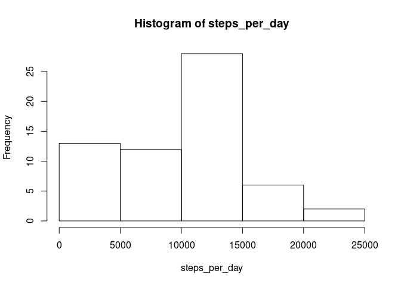
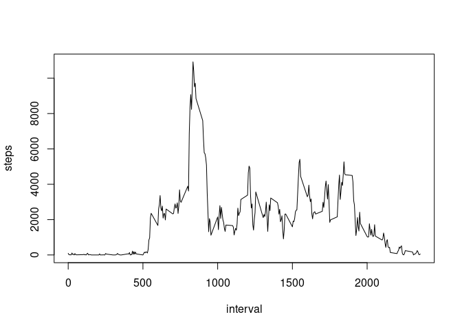
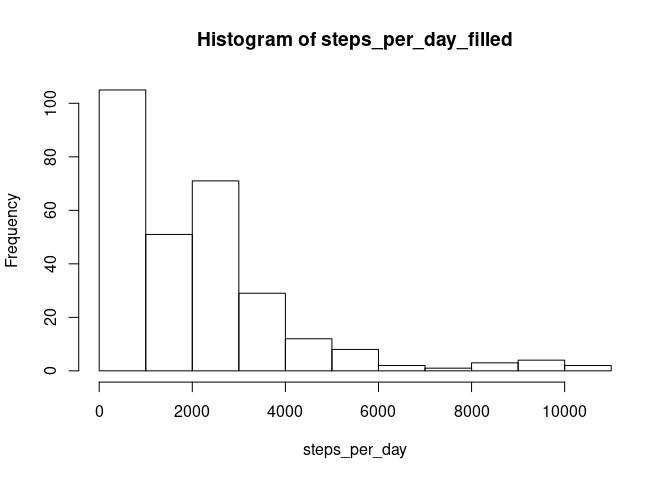
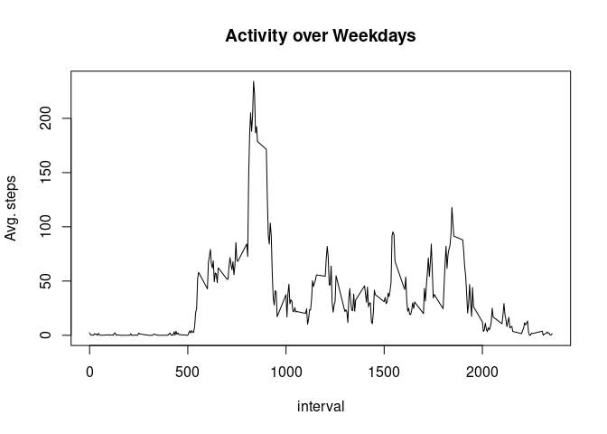
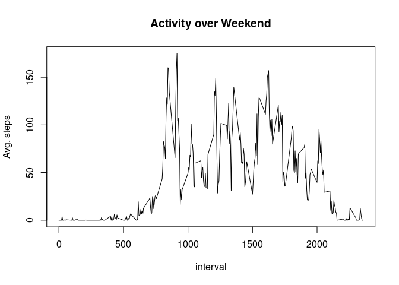

Analysis of walking Steps taken by an individual during 2 months
================

``` r
library(dplyr)
```

    ## 
    ## Attaching package: 'dplyr'

    ## The following objects are masked from 'package:stats':
    ## 
    ##     filter, lag

    ## The following objects are masked from 'package:base':
    ## 
    ##     intersect, setdiff, setequal, union

``` r
setwd("/home/amol/Projects/coursera/R/RepData_PeerAssessment1/")
```

## Loading and preprocessing the data

``` r
data<-read.csv("activity.csv")
```

\#We will look at data, column data type and stats about steps

\#\#mean total number of steps tak

``` r
steps_per_day<-tapply(data$steps,data$date,function(x) sum(x,na.rm=TRUE))
mean(steps_per_day,na.rm=TRUE)
```

    ## [1] 9354.23

``` r
median(steps_per_day,na.rm=TRUE)
```

    ## [1] 10395

``` r
hist(steps_per_day)
```

<!-- --> -Mean of total
steps per day = 9354 -Median of total steps per day = 10,395

\#\#Daily activity pattern

``` r
steps_per_interval<-tapply(data$steps,data$interval,function(x) sum(x,na.rm=TRUE))
mean(steps_per_interval,na.rm=TRUE)
```

    ## [1] 1981.278

``` r
plot(names(steps_per_interval),steps_per_interval,type="l",xlab="interval",ylab="steps")
```

<!-- -->

``` r
which(steps_per_interval==max(steps_per_interval))
```

    ## 835 
    ## 104

-   Heighest number of steps are observed in interval 835 \#\#Missing
    Values

\#Filling missing Values

``` r
data_filled<-data
mean_steps<-tapply(data$steps,data$interval,function(x) mean(x,na.rm = TRUE))
for (i in 1:length(data)){
    if (is.na(data[i,1])){
        data_filled[i,1]<-as.numeric(mean_steps[i])
    }
}
steps_per_day_filled <- tapply(data_filled$steps,data_filled$interval,function(x) sum(x,na.rm = TRUE))
hist(steps_per_day_filled,,xlab="steps_per_day")
```

<!-- -->

``` r
mean(steps_per_day_filled,na.rm=TRUE)
```

    ## [1] 1981.285

``` r
median(steps_per_day_filled,na.rm=TRUE)
```

    ## [1] 1808

-Mean of total steps per day = 1981 -Median of total steps per day =
1808

The mean values have gone down by almost 5 times.

\#\#Are there differences in activity patterns between weekdays and
weekends?

``` r
data_filled$date<-as.Date(data_filled$date)
data_filled$day<-sapply(data_filled$date,weekdays)
f<-function(x){ if (x=='Sunday'|x=="Saturday")
    return ("Weekend") 
    else return ("Weekday")}
data_filled$day<-sapply(data_filled$day,f)
```

``` r
par(c(2,1))
```

    ## NULL

``` r
data_day<- data_filled%>%select(day,interval,steps)%>%group_by(day,interval)%>%summarize(mean=mean(steps,na.rm=TRUE))
```

    ## `summarise()` has grouped output by 'day'. You can override using the `.groups` argument.

``` r
data_day_weekday<-data_day%>%filter(day=='Weekday')
data_day_weekend<-data_day%>%filter(day=='Weekend')
head(data_day_weekend)
```

    ## # A tibble: 6 x 3
    ## # Groups:   day [1]
    ##   day     interval  mean
    ##   <chr>      <int> <dbl>
    ## 1 Weekend        0  0   
    ## 2 Weekend        5  0   
    ## 3 Weekend       10  0   
    ## 4 Weekend       15  0   
    ## 5 Weekend       20  0   
    ## 6 Weekend       25  3.71

``` r
plot(data_day_weekday$interval,data_day_weekday$mean,xlab="interval",ylab="Avg. steps",main="Activity over Weekdays",type="l")
```

<!-- -->

``` r
plot(data_day_weekend$interval,data_day_weekend$mean,xlab="interval",ylab="Avg. steps",main="Activity over Weekend",type="l")
```

<!-- -->
